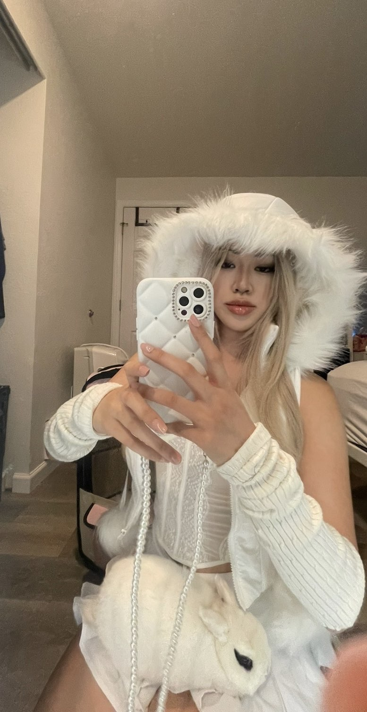

# Tammy H. Le

## About Me 

Hello, welcome to my GITHUB! This is me, an Electrical and Computer Engineering student at the University of Washington - Seattle. I'm passionate about challenging myself to grow, multitasking, and exploring business and technology. My goal is to learn, create sustainable projects, and make a positive impact locally and globally through leadership experiences and leveraging my tech expertise for meaningful change. 

##  K-12 Tech. Experience...
In elementary school, I would mess around with HTML to customize personal websites from games. In middle school, I participated in Techology Student Association (TSA) and worked with 3D printing/engraving machines, soldering, and built a CO2 drag car as my first project along with the use of technical equipment. I built and customized websites during my spare time. In high school, I participated in robotics for 2/3 years and enrolled in AP Computer Science courses during my junior and senior years. During the summer, I enrolled in Python courses my junior/senior summer.

##  [Updating Soon] College/University Experience...
First couple years in college, I partcipated Society Women Engineering (SWE) along with a few other clubs. During my academic career, I've builted mulitple GUI's with Java ranging from solitare to tik tac toe games, etc. and learnt the basics of Electrical and Computer Engineering. 

